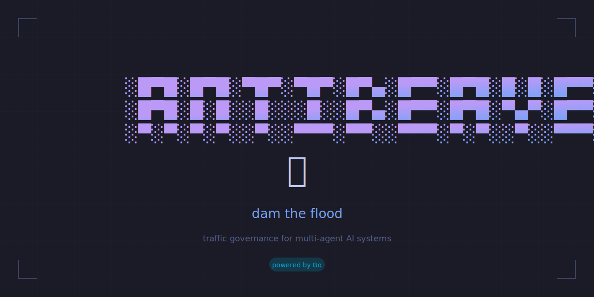

<p align="center">
  
</p>

<p align="center">
  <strong>Traffic governance for multi-agent AI systems</strong><br>
  <em>Circuit breaking • Message buffering • Thought coalescing</em>
</p>

<p align="center">
  <a href="#installation">Installation</a> •
  <a href="#usage">Usage</a> •
  <a href="#commands">Commands</a> •
  <a href="#integration">Integration</a>
</p>

---

## The Problem

Multi-agent AI systems can create distributed feedback loops — the "flywheel effect" — where agents trigger each other in cascading chains. Network congestion amplifies this: delayed responses stack up, then flood the system when connectivity returns.

**antibeaver** is the dam. It detects network stress, buffers outgoing thoughts, and synthesizes them into coherent messages when conditions improve.

## Installation

```bash
# From source
go install github.com/rickhallett/antibeaver/cmd/antibeaver@latest

# Or clone and build
git clone https://github.com/rickhallett/antibeaver-go
cd antibeaver-go
go build -o antibeaver ./cmd/antibeaver
```

## Usage

```bash
# Check system status
antibeaver status

# Buffer a thought (will be synthesized later)
antibeaver buffer "Deploy the new feature to staging"

# Buffer with priority
antibeaver buffer --priority P0 "CRITICAL: Production is down"

# Flush buffered thoughts (generates synthesis prompt)
antibeaver flush

# Manual controls
antibeaver halt      # Force all buffering
antibeaver resume    # Clear halt and resume normal ops
antibeaver force     # Enable forced buffering
antibeaver simulate 15000  # Simulate 15s latency
```

## Commands

| Command | Description |
|---------|-------------|
| `status` | Show current system status (buffering state, pending thoughts, latency) |
| `buffer` | Buffer a thought for later synthesis |
| `flush` | Flush buffered thoughts and generate synthesis prompt |
| `halt` | Halt the system (force all buffering) |
| `resume` | Resume normal operations |
| `force` | Force buffering on (manual override) |
| `simulate` | Set simulated network latency for testing |
| `record-latency` | Record a latency sample |
| `version` | Show version |

### Flags

| Flag | Description |
|------|-------------|
| `--db` | Path to SQLite database (default: `~/.openclaw/antibeaver/governance.db`) |
| `--json` | Output as JSON |
| `--no-color` | Disable colors |
| `--agent` | Agent ID (default: `main`) |
| `--priority` | Priority level: P0 (critical), P1 (normal), P2 (low) |

## Integration

### With OpenClaw

antibeaver is designed to work with [OpenClaw](https://github.com/openclaw/openclaw) multi-agent systems. The TypeScript plugin calls the Go binary for all operations:

```typescript
// In your OpenClaw plugin
import { exec } from 'child_process';

const status = await exec('antibeaver status --json');
```

### As a Library

The internal packages can be imported directly:

```go
import (
    "github.com/rickhallett/antibeaver/internal/db"
    "github.com/rickhallett/antibeaver/internal/synthesis"
    "github.com/rickhallett/antibeaver/internal/tracker"
)
```

## Architecture

```
┌─────────────────────────────────────────────────────────────┐
│                      antibeaver CLI                         │
├─────────────────────────────────────────────────────────────┤
│  cmd/antibeaver/     │  Cobra CLI, Tokyo Night styling     │
├──────────────────────┼──────────────────────────────────────┤
│  internal/tracker/   │  In-memory latency tracking          │
│  internal/synthesis/ │  Prompt generation, buffering logic  │
│  internal/db/        │  SQLite persistence (WAL mode)       │
└──────────────────────┴──────────────────────────────────────┘
```

## Development

```bash
# Run tests
go test ./...

# Run with coverage
go test ./... -cover

# Build
go build -o antibeaver ./cmd/antibeaver
```

### Test Coverage

| Package | Coverage |
|---------|----------|
| `internal/tracker` | 100% |
| `internal/synthesis` | 98.4% |
| `internal/db` | 82.5% |

## License

MIT

---

<p align="center">
  <em>Dam it.</em> 🦫
</p>
